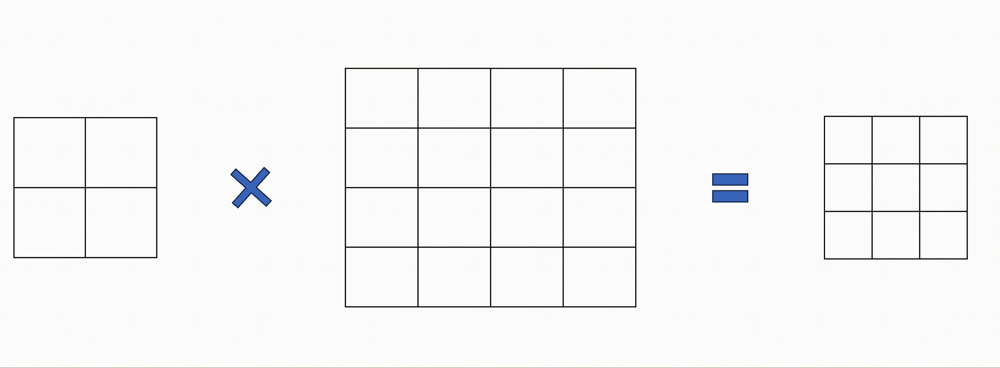
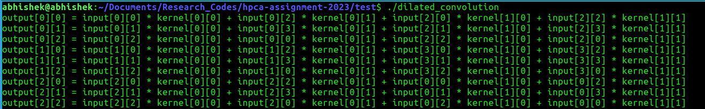

# HPCA Assignment
In this assignment, your task is to optimize the problem of “Dilated Convolution (DC)” which involves an input matrix and a kernel matrix. The sample algorithm is depicted below using an animation.

### Input:  

A. Input Matrix of dimensions: $\text{Input-Row} \times \text{Input-Column}$.

B. Kernel Matrix of dimensions: $\text{Kernel-Row} \times \text{Kernel-Column}$. 

### Output:  

An Output Matrix of dimensions: $(\text{Input-Row}-\text{Kernel-Row}+1)  \times (\text{Input-Column} - \text{Kernel-Column} +1)$ 

### Explanation and algorithm of DC: 

Dilated Convolution (DL) is a variant of the convolution operation. Following is the explanation of the algorithm: 

Let us assume for the explanation of the algorithm that the dimensions of the Input Matrix and Kernel Matrix are as follows: 

A. Input Matrix $(I)$: $4\times4$

B. Kernel Matrix $(K)$: $2\times2$ 

So, dimensions of the Output Matrix $(O)$ shall be (based on calculation): $3\times3$. 

[ $\text{Output-Row} = \text{Input-Row} - \text{Kernel-Row} + 1 = 4 - 2 + 1 = 3$. Calculation is similar for $\text{Output-Column}$.] 

The Kernel Matrix $(K)$ slides over the Input Matrix $(I)$ and produces each cell of the Output Matrix $(O)$ as shown below. In the animation below, The Kernel Matrix $(K)$ is the left-most, the Input-Matrix $(I)$ is in the middle, and the Output Matrix $(O)$ is the right-most.



---

## Optimize dilated convolution using hardware counters.
Contained are three folders:
* PartA: Contains setup for single-threaded and multi-threaded program.
* PartB: Contains setup for GPU program.
* test: Contains a test program to aid in understanding the algorithm.

Each of the folders PartA and PartB contain two sub-folders, a Makefile, and a main program.
* Makefile: Contains commands necessary to compile, generate inputs, and run the program.
* data folder: Contains program that generates input, and will contain input once generated.
* header folder: Files containing the function that performs the operation. Modify the files in this folder.
* main.cpp: Program that takes inputs and executes the functions. DO NOT MODIFY THIS.

Navigate to each folder to begin setting up the system.
Inside each folder do the following:
### Compiling and generating input
Use the following command to compile the programs and generate required input:
```
make
```
## PART A
### Running program
You can use make to run the executable with the following command:
```
make run
```
Alternatively, you can manually run the program for the different input sets using the following commands:
```
./dilated_conv -i data/4096.in -k data/13.in
./dilated_conv -i data/8192.in -k data/64.in
./dilated_conv -i data/16384.in -k data/3.in
```
Note: the `-i` flag is for the input matrix and `-k` flag is for the kernel matrix.
## PART B
To compile the code for use on native GPU use the following command:
```
make server
```
For use with GPGPU-Sim, additional flags are required during compilation, which can be done with the following command:
```
make sim
```

You can use make to run the executable with the following command for native execution:
```
make run_server
```
When running on GPGPU-Sim, use the following command instead:
```
make run_sim
```

## test

This directory contains a simple program to help you understand how the algorithm works. You can play around with the sizes of the Input-Matrix $(I)$ and Kernel-Matrix $(K)$ to get a flavor of how each cell of Output-Matrix $(O)$ is generated. A stripped output of test executable mentioned above for the example discussed is as follows:

